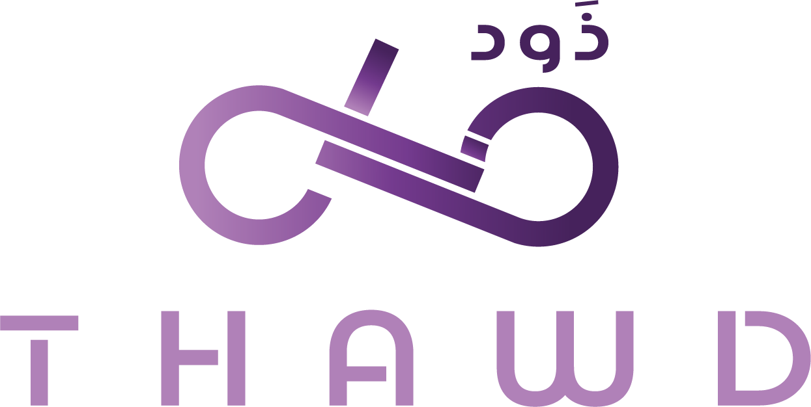

# Thawd Saturday

Welcome to the **Thawd Saturday** repository! This repository is a companion to our YouTube series, where we explore various [MITRE ATT&CK](https://attack.mitre.org/) techniques, software, and groups on the last Saturday of every month. 

## About the Series

Thawd Saturday is a YouTube series designed to help you understand various [MITRE ATT&CK](https://attack.mitre.org/) techniques, software, and groups and how to simulate and detect them in your environment.

## Repository Structure

- **`/techniques/`**: Contains code and detection rules for specific MITRE ATT&CK techniques.
- **`/software/`**: Contains guides and detection rules for specific MITRE ATT&CK software.
- **`/groups/`**: Contains guides and detection rules for specific MITRE ATT&CK groups.

## How to Use

Each directory includes simulation snippets and Sigma detection rules around a technique, software, or group that you can use in your test environment. Follow the instructions provided in the companion YouTube videos for each directory for more information.

## Links to Episodes

- [T1543.003 - Windows Services](https://www.youtube.com/watch?v=d70FJjBAIAA)

## Contributing

We welcome contributions! Please do not hesitate to reach out to us if you have ideas or additional content you'd like to share!

## Contact

If you have any questions or feedback, feel free to reach out to us via [Email](mailto:contact@thawd.io), [X](https://x.com/ThawdSecurity), or [LinkedIn.](https://www.linkedin.com/company/thawdsecurity/)
